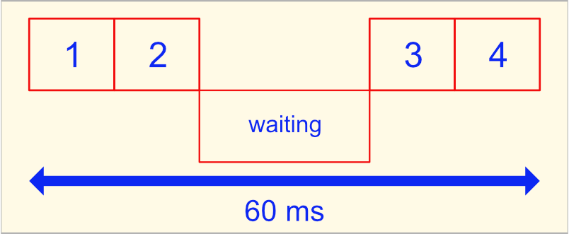
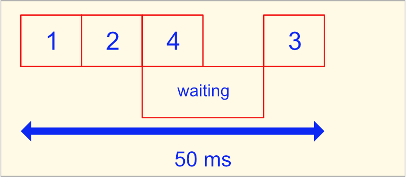

# Getting Work Done

## If written in a blocking language (python):

```python
import requests

r = requests.get('someUrl')

print r.text

print 'after the request'
```



<br/><br/>

## Written in non-blocking language (JavaScript)

```javascript
import request from 'request';

request('someUrl', function(error, response, body) {
  console.log(body);
});

console.log('after the request');
```



#

