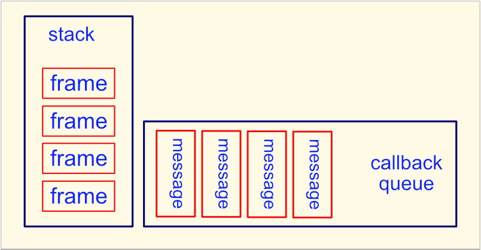

# Event Loop

JavaScript has a concurrency model based on an event loop.
- execute code
- collect and process events
- execute queued tasks

## Simplified Model

The event loop implementations in modern JavaScript engines and in node are much more complex and optimized.

#### Current Execution
* frame - the entry point to a function, including arguments and local variables

* stack - a Last-in-First-Out data structure containing stack frames

#### Pending Execution
* message - the entry point to a callback function

* callback queue - a First-in-First-Out data structure containing messages

## One Pass

- A message is removed from the queue.
- A frame is pushed onto the empty stack.
- The function defined by the frame is executed.
- If the current function calls other functions,
additional frames are defined and pushed onto the stack.
- The current function can add messages to the callback queue.
- A frame is popped off of the stack when its function exits.
- The pass through the event loop is complete when the stack is empty.

## Run to Completion

- A message is processed completely (the stack becomes empty) before any other messages are processed.
- The code cannot be pre-empted.
