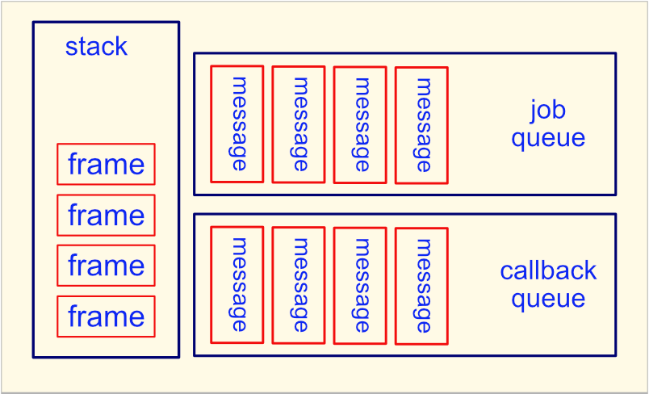

# Event Loop - Less Simplified

There is more than one queue

- the callback queue - previously defined
  - also known as the event queue, macrotask queue
- the job queue - added for promises
  - also known as the promise queue, microtask queue, ES6 job queue

### One Pass, Revised

- the contents of the stack are run to completion to finish the current message
  - new messages can be added to the callback queue
  - new messages can be added to the job queue (via promise handler callbacks)
- all messages in the job queue are placed on the stack, one at a time, and run to completion
  - new messages added to the callback queue will be handled in normal callback queue order
  - new messages added to the job queue will be run during the current pass
- the next pass through the event loop only starts when the stack frame AND the job queue are empty

  

> This means all promise handlers (`.then()`, `.catch()`, `.finally()`) added to the job queue
> during the current pass, will be executed at the end of the
> current pass, and before the start of the next pass.

[demo - messages and event loop](b-step1500a.js)

  

## Explicitly Enqueue Messages

Just like `setTimeout(() => {}, 0)` can be used to add a message to the callback queue,
`Promise.resolve().then(() => {})` can be used to add a message to the job queue.

### Alternate APIs

> In node, there is an API for explicitly adding a message to the callback queue
> (but with some differences): `process.nextTick()`

> There is an API for explicitly adding a message to the job queue: `queueMicrotask()`

[demo - alternate APIs](b-step1500b.js)

    

[next](../1600/a-step1600.md)
